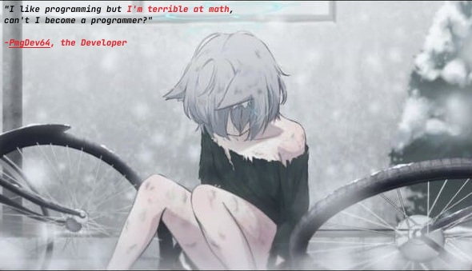

  

# [VI] Tôi là người Việt nam, là quản lí của PmgTeam.
# [EN] I'm Vietnamese, manager of PmgTeam.
# [JP] 私はベトナム人で、PmgTeam のマネージャーです。(Watashi wa Betonamu hito de, PmgTeam no manējādesu.)

---
### My Stats:

  
  
  

---
### Favorites Programming Language, OS, IDE:

   

---
### Currently Learning:

   

---
### Snap Changelogs:

  

